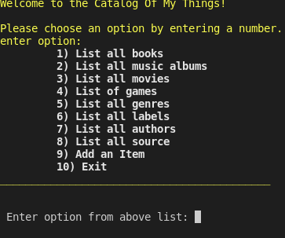
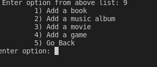
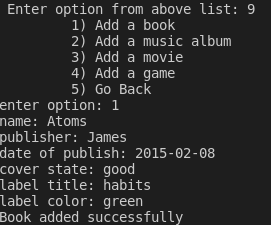
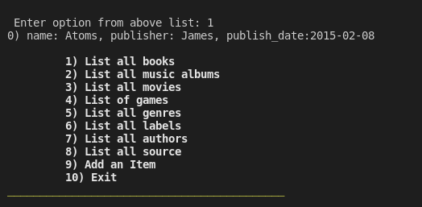

# Ruby group capstone - Catalog of my things

> In this project, we created a console app that will help you to keep a record of different types of things you won: books, music albums, movies, and games. The data is then stored in JSON files.

## Screenshots

> | Screenshot 1         | Screenshots 2        |
> | -------------------- | -------------------- | --- |
> |  |  | !   |
> | Screenshot 3         | Screenshots 4        |
> | --------------       | ----------------     |
> |  |  | !   |

Additional description about the project and its features.

## Built With

- Ruby
- SQL

## Getting Started

To get a local copy up and running follow these simple example steps.

### Prerequisites

```
Ruby
Rspec
```

## Getting Started

To get a local copy up and running follow these simple example steps.

### Prerequisites

- [Ruby](https://www.ruby-lang.org/en/)

### Setup

- `git clone https://github.com/mmatongo/catalog-of-my-things.git`
  or
- `git clone git@github.com:mmatongo/catalog-of-my-thing.git`

- `cd catalog-of-my-things`

### Running The App

- Run `ruby main.rb` to run the console app.

### Test

- Run `gem install rspec` to install Rspec,

- Run `rspec spec` to run all the test cases, and

- Run `rspec spec/name_of_test_file.rb` to run test cases individually.

```
## Authors

👤 **Taro Chilongoshi**

- GitHub: [@githubhandle](https://github.com/Tchilo)
- LinkedIn: [LinkedIn](https://linkedin.com/in/TaroChilongoshi)

👤 **Isaac Lumato**

- GitHub: [@githubhandle](https://github.com/isaka-lumato)
- LinkedIn: [LinkedIn](https://linkedin.com/in/lumatoisaac)

👤 **Yahya El Ganayni**

- GitHub: [@githubhandle](https://github.com/yahyaelganyni1)
- LinkedIn: [LinkedIn](https://www.linkedin.com/in/yahya-el-ganayni-a456115b/)

👤 **Mahbub Alam**

- GitHub: [@githubhandle](https://github.com/mahbubul14)
- LinkedIn: [LinkedIn]()


## 🤝 Contributing

Contributions, issues, and feature requests are welcome!

Feel free to check the [issues page](../../issues/).

## Show your support

Give a ⭐️ if you like this project!

## Acknowledgments

- Hat tip to anyone whose code was used
- Inspiration
- etc

## 📝 License

This project is [MIT](./MIT.md) licensed.
```
